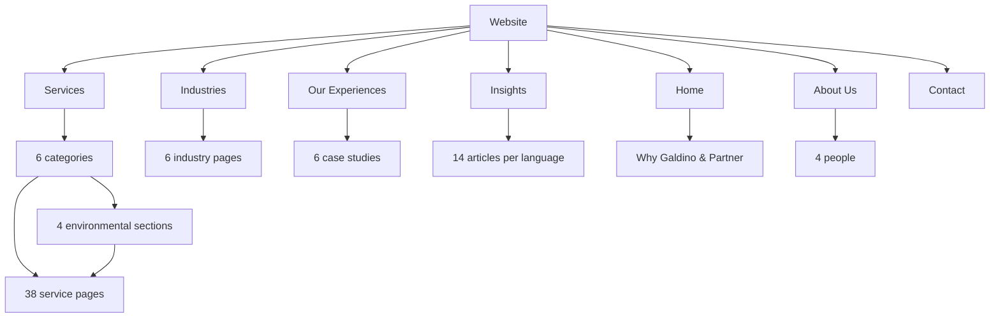

# Website architecture

Updated 30 September 2026. This is the approved replacement structure: 38 services, six categories, four environmental groups, six industries. Old PT/CV/PMA/NIB/LKPM/HAKI service offers are absent; informational articles may discuss those concepts without offering them as services.

## Navigation and hierarchy

Header: Home → Services → Industries → Our Experiences → Insights → About Us + Consultation CTA. Contact uses the main immersive navbar; Home has a Why Galdino & Partner section. The service mega menu links directly to six hubs and 38 service pages. About Us also links to four people. Footer repeats the main routes and provides Privacy, Terms, cookie preferences and contact channels.

## Page inventory and language pairs

Existing top-level route segments are retained for stable links; nested service and industry slugs are localised. Every page provides reciprocal Indonesian/English alternates. The root redirects to Indonesian.

| Page | Indonesian URL | English URL |
|---|---|---|
| Home | /id/ | /en/ |
| Layanan | /id/services/ | /en/services/ |
| Industri | /id/industries/ | /en/industries/ |
| Our Experiences | /id/projects/ | /en/projects/ |
| Insight | /id/blog/ | /en/blog/ |
| About Us | /id/profile/ | /en/profile/ |
| Kontak | /id/contact/ | /en/contact/ |
| Privasi | /id/privacy/ | /en/privacy/ |
| Ketentuan | /id/terms/ | /en/terms/ |
| **Perizinan Reklame** | /id/services/reklame/ | /en/services/advertising-permits/ |
| ↳ Jasa Pajak Reklame | /id/services/reklame/pajak-reklame/ | /en/services/advertising-permits/advertising-tax/ |
| ↳ Jasa Izin Reklame | /id/services/reklame/izin-reklame/ | /en/services/advertising-permits/advertising-permit/ |
| ↳ Jasa Perpanjangan Reklame | /id/services/reklame/perpanjangan-reklame/ | /en/services/advertising-permits/advertising-renewal/ |
| ↳ Jasa PBG Reklame | /id/services/reklame/pbg-reklame/ | /en/services/advertising-permits/advertising-structure-approval/ |
| ↳ Jasa Audit Legalitas Reklame | /id/services/reklame/audit-legalitas-reklame/ | /en/services/advertising-permits/advertising-compliance-audit/ |
| ↳ Jasa Manajemen Reklame Multi-Lokasi | /id/services/reklame/manajemen-reklame-multi-lokasi/ | /en/services/advertising-permits/multi-site-advertising/ |
| **Perizinan Tata Ruang** | /id/services/tata-ruang/ | /en/services/spatial-planning/ |
| ↳ Jasa KKPR | /id/services/tata-ruang/kkpr/ | /en/services/spatial-planning/spatial-use-conformity/ |
| ↳ Jasa KRK | /id/services/tata-ruang/krk/ | /en/services/spatial-planning/planning-information/ |
| ↳ Jasa IPPR | /id/services/tata-ruang/ippr/ | /en/services/spatial-planning/spatial-utilisation-approval/ |
| ↳ Jasa IPPT | /id/services/tata-ruang/ippt/ | /en/services/spatial-planning/land-use-approval/ |
| **Perizinan Bangunan & Konstruksi** | /id/services/bangunan-konstruksi/ | /en/services/buildings-construction/ |
| ↳ Jasa PBG - IMB | /id/services/bangunan-konstruksi/pbg-imb/ | /en/services/buildings-construction/building-approval/ |
| ↳ Jasa SLF | /id/services/bangunan-konstruksi/slf/ | /en/services/buildings-construction/building-function-certificate/ |
| ↳ Jasa SLO Kelistrikan | /id/services/bangunan-konstruksi/slo-kelistrikan/ | /en/services/buildings-construction/electrical-operation-certificate/ |
| ↳ Jasa SBU Konstruksi - SBUJK | /id/services/bangunan-konstruksi/sbu-konstruksi/ | /en/services/buildings-construction/construction-business-certificate/ |
| **Perizinan Lingkungan** | /id/services/lingkungan/ | /en/services/environmental-approvals/ |
| ↳ Dokumen Lingkungan | /id/services/lingkungan/#dokumen-lingkungan | /en/services/environmental-approvals/#environmental-documents |
| ↳ Persetujuan Teknis Lingkungan | /id/services/lingkungan/#persetujuan-teknis | /en/services/environmental-approvals/#technical-approvals |
| ↳ Pelaporan & Compliance Lingkungan | /id/services/lingkungan/#pelaporan-compliance | /en/services/environmental-approvals/#reporting-compliance |
| ↳ Penyelesaian Dokumen Lingkungan | /id/services/lingkungan/#penyelesaian-dokumen | /en/services/environmental-approvals/#compliance-resolution |
| ↳ Jasa SPPL | /id/services/lingkungan/sppl/ | /en/services/environmental-approvals/environmental-undertaking/ |
| ↳ Jasa UKL-UPL | /id/services/lingkungan/ukl-upl/ | /en/services/environmental-approvals/environmental-management-monitoring/ |
| ↳ Jasa AMDAL | /id/services/lingkungan/amdal/ | /en/services/environmental-approvals/environmental-impact-assessment/ |
| ↳ Jasa PERTEK Air Limbah - IPLC | /id/services/lingkungan/pertek-air-limbah/ | /en/services/environmental-approvals/wastewater-technical-approval/ |
| ↳ Jasa PERTEK Emisi | /id/services/lingkungan/pertek-emisi/ | /en/services/environmental-approvals/emission-technical-approval/ |
| ↳ Jasa SLO Lingkungan | /id/services/lingkungan/slo-lingkungan/ | /en/services/environmental-approvals/environmental-operation-clearance/ |
| ↳ Jasa RKL-RPL | /id/services/lingkungan/rkl-rpl/ | /en/services/environmental-approvals/environmental-monitoring-reports/ |
| ↳ Jasa DELH | /id/services/lingkungan/delh/ | /en/services/environmental-approvals/environmental-evaluation-document/ |
| ↳ Jasa DPLH | /id/services/lingkungan/dplh/ | /en/services/environmental-approvals/environmental-management-document/ |
| **Lalu Lintas & Akses Jalan** | /id/services/lalu-lintas-akses/ | /en/services/traffic-road-access/ |
| ↳ Jasa Andalalin | /id/services/lalu-lintas-akses/andalalin/ | /en/services/traffic-road-access/traffic-impact-analysis/ |
| ↳ Jasa MRLL | /id/services/lalu-lintas-akses/mrll/ | /en/services/traffic-road-access/traffic-management-engineering/ |
| ↳ Jasa INRIT | /id/services/lalu-lintas-akses/inrit/ | /en/services/traffic-road-access/driveway-access/ |
| ↳ Jasa Izin Bukaan Median | /id/services/lalu-lintas-akses/bukaan-median/ | /en/services/traffic-road-access/median-opening/ |
| **Sertifikasi ISO & Sistem Manajemen** | /id/services/iso/ | /en/services/iso-management-systems/ |
| ↳ Jasa Sertifikasi ISO 9001 | /id/services/iso/sertifikasi-iso-9001/ | /en/services/iso-management-systems/certification-iso-9001/ |
| ↳ Jasa Sertifikasi ISO 14001 | /id/services/iso/sertifikasi-iso-14001/ | /en/services/iso-management-systems/certification-iso-14001/ |
| ↳ Jasa Sertifikasi ISO 45001 | /id/services/iso/sertifikasi-iso-45001/ | /en/services/iso-management-systems/certification-iso-45001/ |
| ↳ Jasa Sertifikasi ISO 22000 | /id/services/iso/sertifikasi-iso-22000/ | /en/services/iso-management-systems/certification-iso-22000/ |
| ↳ Jasa Sertifikasi ISO/IEC 27001 | /id/services/iso/sertifikasi-iso-27001/ | /en/services/iso-management-systems/certification-iso-27001/ |
| ↳ Jasa Sertifikasi ISO 37001 | /id/services/iso/sertifikasi-iso-37001/ | /en/services/iso-management-systems/certification-iso-37001/ |
| ↳ Jasa Sertifikasi ISO 50001 | /id/services/iso/sertifikasi-iso-50001/ | /en/services/iso-management-systems/certification-iso-50001/ |
| ↳ Jasa Sertifikasi ISO 13485 | /id/services/iso/sertifikasi-iso-13485/ | /en/services/iso-management-systems/certification-iso-13485/ |
| ↳ Jasa Pendampingan Akreditasi ISO/IEC 17025 | /id/services/iso/akreditasi-iso-17025/ | /en/services/iso-management-systems/accreditation-iso-17025/ |
| ↳ Jasa Pendampingan Akreditasi ISO 15189 | /id/services/iso/akreditasi-iso-15189/ | /en/services/iso-management-systems/accreditation-iso-15189/ |
| ↳ Jasa Pendampingan Akreditasi ISO/IEC 17020 | /id/services/iso/akreditasi-iso-17020/ | /en/services/iso-management-systems/accreditation-iso-17020/ |
| Perizinan untuk Developer Properti | /id/industries/developer-properti/ | /en/industries/property-developers/ |
| Perizinan untuk Pabrik / Manufaktur | /id/industries/manufaktur/ | /en/industries/manufacturing/ |
| Perizinan untuk Gudang | /id/industries/gudang/ | /en/industries/warehouses/ |
| Perizinan untuk Retail & Multi-Outlet | /id/industries/retail-multi-outlet/ | /en/industries/retail-multi-outlet/ |
| Perizinan untuk Klinik / Rumah Sakit | /id/industries/fasilitas-kesehatan/ | /en/industries/healthcare/ |
| Perizinan untuk Hotel | /id/industries/hotel/ | /en/industries/hotels/ |
| UKL-UPL: menyiapkan ekspansi fasilitas pangan. | /id/projects/aruna-pangan/ | /en/projects/aruna-pangan/ |
| Kesiapan sistem keamanan informasi untuk tim teknologi. | /id/projects/nusa-teknologi/ | /en/projects/nusa-teknologi/ |
| Pajak Reklame: menyatukan data lintas outlet. | /id/projects/prima-distribusi/ | /en/projects/prima-distribusi/ |
| Merapikan bukti kesiapan badan usaha konstruksi. | /id/projects/vertex-konstruksi/ | /en/projects/vertex-konstruksi/ |
| Kesiapan dokumen kelaikan dan akses fasilitas gudang. | /id/projects/lintas-logistik/ | /en/projects/lintas-logistik/ |
| PBG: menyelaraskan rencana bangunan dan dokumen tapak. | /id/projects/karya-properti/ | /en/projects/karya-properti/ |
| Hans Galdino | /id/profile/hans-galdino/ | /en/profile/hans-galdino/ |
| Kelvin Anata Lian | /id/profile/kelvin-anata-lian/ | /en/profile/kelvin-anata-lian/ |
| Maria Indah Putri | /id/profile/maria-indah-putri/ | /en/profile/maria-indah-putri/ |
| Michael Alvaro | /id/profile/michael-alvaro/ | /en/profile/michael-alvaro/ |
| "AMDAL vs UKL-UPL: Mulai dari Penapisan Kegiatan" | /id/blog/amdal-vs-ukl-upl/ | /en/blog/amdal-versus-ukl-upl/ |
| "Apa Itu PBG? Mulai dari Fungsi Bangunan dan Dokumen Teknis" | /id/blog/apa-itu-pbg/ | /en/blog/what-is-pbg/ |
| "Berapa Lama Mengurus KKPR? Petakan Faktor Penentu Waktunya" | /id/blog/berapa-lama-mengurus-kkpr/ | /en/blog/how-long-does-kkpr-take/ |
| "Checklist Legalitas Sebelum Bisnis Membuka Cabang atau Aktivitas Baru" | /id/blog/checklist-legalitas-ekspansi/ | /en/blog/legality-checklist-business-expansion/ |
| "Kapan Usaha Membutuhkan Persetujuan Lingkungan?" | /id/blog/kapan-perlu-persetujuan-lingkungan/ | /en/blog/when-environmental-approval-is-needed/ |
| "Perubahan Data Perseroan: Kapan Legalitas Usaha Harus Diperbarui?" | /id/blog/kapan-perubahan-data-perseroan/ | /en/blog/when-to-update-corporate-records/ |
| "LKPM: Siapa yang Wajib Melapor dan Apa yang Perlu Disiapkan?" | /id/blog/lkpm-siapa-wajib-dokumen/ | /en/blog/preparing-investment-activity-reports/ |
| "Memahami Perizinan Berusaha Berbasis Risiko Sebelum Memulai Usaha" | /id/blog/memahami-perizinan-berbasis-risiko/ | /en/blog/understanding-risk-based-licensing/ |
| "Cara Memilih KBLI yang Tepat untuk Kegiatan Usaha" | /id/blog/memilih-kbli-kegiatan-usaha/ | /en/blog/choosing-the-right-kbli/ |
| "PBG vs IMB: Cara Membaca Dokumen Bangunan Lama" | /id/blog/pbg-vs-imb/ | /en/blog/pbg-versus-imb/ |
| "PBG dan SLF: Apa Bedanya dan Kapan Bisnis Membutuhkannya?" | /id/blog/perbedaan-pbg-slf/ | /en/blog/pbg-and-slf-explained/ |
| "Sertifikat Standar OSS-RBA: Kapan Dibutuhkan dan Apa yang Harus Disiapkan?" | /id/blog/sertifikat-standar-oss-rba/ | /en/blog/oss-business-standard-certificate/ |
| "Setelah NIB Terbit: Kewajiban yang Sering Terlewat oleh Pelaku Usaha" | /id/blog/setelah-nib-terbit/ | /en/blog/after-business-identification-issued/ |
| "Syarat SLF: Dokumen dan Kondisi Bangunan yang Perlu Disiapkan" | /id/blog/syarat-slf/ | /en/blog/slf-document-requirements/ |

## Internal linking plan

- Home links to all six service categories, selected cases, About and Contact.
- Services links to six categories and every leaf through six visible HTML sections, with search temporarily hidden.
- The environmental hub contains four anchored sections; services use category/leaf URLs without an intermediate group segment.
- Service detail links to parent category, three related services, assigned people, matching case studies, relevant articles and a preselected contact form.
- Each industry links to relevant services and case studies. Cases link back to services and relevant insights.
- Insights link to supported service details and related articles. People link to their assigned services and insights.
- Breadcrumbs expose Home, Services, category and service. The language switch preserves the corresponding entity.
- XML sitemap and per-language RSS cover public content routes. API, assets and 404 are not editorial pages. The noindex gate remains active.

Middleware redirects the removed How We Work pages to the process section on Home and the former environmental group pages to hub anchors and the former nested service URLs to their shorter equivalents (301). Unsupported removed service URLs return a helpful 404 rather than redirecting to an unrelated offer.
